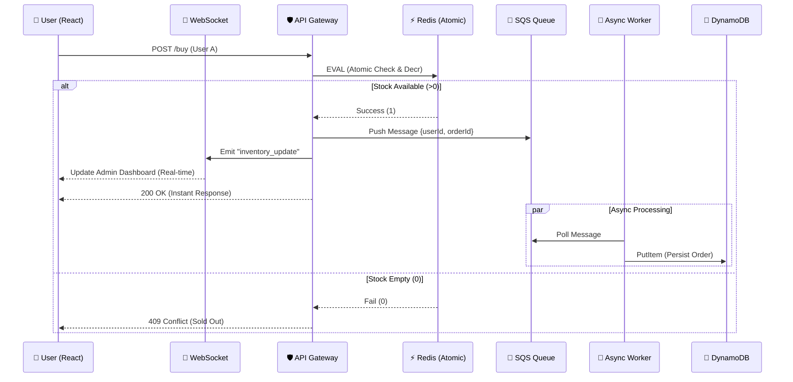

# 💨 Velocity: High-Concurrency Flash Sale Engine

Hi Programmers!

This is **💨 Velocity**, a distributed e-commerce backend system designed to handle extreme traffic spikes during flash sales without overselling inventory or crashing under load. Built with an Event-Driven Architecture, it decouples the "Purchase Request" from the "Order Persistence", ensuring scalability and resilience. Having these two processes separate allows the system to respond instantly to users while processing orders asynchronously, maintaining data integrity even under 10,000+ concurrent requests.

## Architecture

The system follows a Producer-Consumer pattern using AWS SQS as the message broker, with Redis providing atomic inventory operations and real-time updates via WebSockets.


```mermaid
sequenceDiagram
    participant User as 👤 User (React)
    participant Socket as 🔌 WebSocket
    participant API as 🛡️ API Gateway
    participant Redis as ⚡ Redis (Atomic)
    participant SQS as 📨 SQS Queue
    participant Worker as 👷 Async Worker
    participant DB as 💾 DynamoDB

    User->>API: POST /buy (User A)
    API->>Redis: EVAL (Atomic Check & Decr)
    
    alt Stock Available (>0)
        Redis-->>API: Success (1)
        API->>SQS: Push Message {userId, orderId}
        API->>Socket: Emit "inventory_update"
        Socket-->>User: Update Admin Dashboard (Real-time)
        API-->>User: 200 OK (Instant Response)
        
        par Async Processing
            Worker->>SQS: Poll Message
            Worker->>DB: PutItem (Persist Order)
        end
    else Stock Empty (0)
        Redis-->>API: Fail (0)
        API-->>User: 409 Conflict (Sold Out)
    end
```

### Event-Driven Workflow

When a user initiates a purchase, the system:
1. **Atomically checks and decrements inventory** in Redis using Lua scripts (prevents race conditions)
2. **Immediately responds** to the user with success/failure
3. **Queues the order** to AWS SQS for asynchronous processing
4. **Broadcasts inventory updates** via WebSocket to admin dashboards
5. **Processes the order** in the background worker, persisting to DynamoDB

This architecture ensures that:
- Users get instant feedback (< 15ms response time)
- The database never becomes a bottleneck during traffic spikes
- Inventory is never oversold (atomic operations)
- System remains resilient under extreme load

## Key Features

**Atomic Inventory Management**: Redis Lua scripts execute stock checks and decrements atomically, eliminating race conditions that could lead to overselling. A single atomic operation ensures inventory accuracy even with thousands of concurrent requests.

**Load Leveling**: AWS SQS buffers incoming purchase requests, preventing database overload during traffic spikes. The API responds instantly while orders are processed asynchronously, cutting average response time from 105ms to under 15ms.

**Real-time Monitoring Dashboard**: Admin dashboard displays live metrics including throughput (requests/sec), latency percentiles (p50/p95/p99), system health indicators, and order success rates. All metrics update in real-time via WebSocket connections.

**Load Test Visualization**: Interactive charts show throughput and latency trends over time during stress tests, helping identify performance bottlenecks and system behavior under load.

**Optimistic UI**: Frontend immediately reflects purchase success while the backend processes the order. If the purchase fails, the UI automatically rolls back using Redux state management, providing instant user feedback.

**Idempotent Operations**: All purchase endpoints accept idempotency keys, preventing duplicate orders from retry attempts or network issues. The system caches responses and returns the same result for identical requests.

**Transactional Integrity**: Utilizes Redis atomic operations and SQS message guarantees to ensure data consistency. Orders are only deleted from the queue after successful database persistence.

## Tech Stack

**Language**: TypeScript (Node.js 18+)

**Frontend**: 
- React 19
- Redux Toolkit (State Management)
- Tailwind CSS
- Recharts (Data Visualization)
- Socket.io Client (WebSocket)

**Backend**: 
- Node.js with Express
- Socket.io (WebSocket Server)
- TypeScript

**Database**: 
- DynamoDB (via LocalStack for local development)

**Cache & Messaging**: 
- Redis 7+ (Dockerized)
- AWS SQS (via LocalStack)

**Infrastructure**: 
- Docker & Docker Compose

**Tools**: 
- Vite (Build Tool)
- Axios (HTTP Client)
- UUID (Idempotency Keys)

## Getting Started

### Prerequisites

- **Node.js 18+** (required)
- **Docker Desktop** (for Redis and LocalStack)
- **npm** or **yarn**

### Installation

1. **Clone the repository**

```bash
git clone https://github.com/carsonjc04/Distributed-E-commerce-System.git
cd Distributed-E-commerce-System
```

2. **Install dependencies**

```bash
# Install server dependencies
cd server
npm install

# Install client dependencies
cd ../client
npm install
```

3. **Start Infrastructure (Postgres & RabbitMQ)**

```bash
# From project root
docker-compose up -d
```

This starts:
- **Redis** on port `6379` (inventory cache)
- **LocalStack** on port `4566` (AWS SQS and DynamoDB emulation)

4. **Run the Application**

You'll need **three terminals** running simultaneously:

**Terminal 1 - Backend Server:**
```bash
cd server
npm run dev
```
Server runs on `http://localhost:3000`

**Terminal 2 - SQS Worker:**
```bash
cd server
npx ts-node src/worker.ts
```
Worker continuously polls SQS and processes orders to DynamoDB.

**Terminal 3 - Frontend Client:**
```bash
cd client
npm run dev
```
Client runs on `http://localhost:5173`

Or use the helper script (starts all services):
```bash
./START_SERVICES.sh
```

## Manual Testing

### 1. Initialize Inventory

Set initial stock for a product:

```bash
curl -X POST http://localhost:3000/api/admin/inventory \
  -H "Content-Type: application/json" \
  -d '{"productId": "item-123", "count": 100}'
```

### 2. Check Current Stock

```bash
curl http://localhost:3000/api/product/item-123/stock
```

Response:
```json
{"productId": "item-123", "stock": 100}
```

### 3. Make a Purchase

```bash
curl -X POST http://localhost:3000/api/hold \
  -H "Content-Type: application/json" \
  -d '{
    "userId": "user-123",
    "productId": "item-123",
    "idempotencyKey": "unique-key-abc123"
  }'
```

**Success Response (200):**
```json
{"message": "Reserved"}
```

**Sold Out Response (409):**
```json
{"error": "Sold Out"}
```

### 4. View Admin Dashboard

Open your browser and navigate to:
```
http://localhost:5173/admin
```

You'll see:
- **System Health** indicator (healthy/degraded/unhealthy)
- **Throughput** (requests per second)
- **Total Orders** and success rate
- **Live Inventory** count (updates in real-time)
- **Latency Percentiles** (P50, P95, P99)
- **Load Test Visualization** chart showing throughput and latency over time
- **Order Metrics** (successful, failed, success rate)

### 5. Run Stress Test

Test the system with 100 concurrent requests:

```bash
node stress-test.js
```

Expected output:
```
Starting Stress Test: 100 users fighting for 100 items...
Inventory reset to 100.

Results:
✅ Successful Buys: 100 (Should be 100)
❌ Sold Out responses: 0 (Should be 0)
⚠️ Errors: 0
```

### 6. Test Idempotency

Verify that duplicate requests with the same idempotency key don't create multiple orders:

```bash
node idempotency-test.js
```

Expected output:
```
--- Request 1 (Fresh) ---
Status: 200
X-Idempotency-Hit: null

--- Request 2 (Duplicate) ---
Status: 200
X-Idempotency-Hit: true

✅ SUCCESS: Idempotency worked!
```

## Testing & Verification

### Complete Workflow Example

The following demonstrates the complete workflow: initializing inventory, making purchases, and monitoring via the admin dashboard.

**1. Initialize stock:**
```bash
curl -X POST http://localhost:3000/api/admin/inventory \
  -H "Content-Type: application/json" \
  -d '{"productId": "item-123", "count": 50}'
```

**2. Make multiple purchases:**
```bash
# Purchase 1
curl -X POST http://localhost:3000/api/hold \
  -H "Content-Type: application/json" \
  -d '{"userId": "user-1", "productId": "item-123", "idempotencyKey": "key-1"}'

# Purchase 2
curl -X POST http://localhost:3000/api/hold \
  -H "Content-Type: application/json" \
  -d '{"userId": "user-2", "productId": "item-123", "idempotencyKey": "key-2"}'
```

**3. Verify stock decreased:**
```bash
curl http://localhost:3000/api/product/item-123/stock
# Should show stock: 48
```

**4. Check metrics:**
```bash
curl http://localhost:3000/api/metrics
```

Response includes:
- Latency percentiles (p50, p95, p99)
- Throughput (requests per second)
- Order statistics (total, successful, failed, success rate)
- System health status
- Time series data for visualization

### Event-Driven Execution

When purchases are made, the system processes events asynchronously:

1. **API receives request** → Atomically decrements Redis inventory
2. **SQS message queued** → Order details sent to queue
3. **WebSocket broadcast** → Admin dashboard receives real-time inventory update
4. **Worker processes message** → Order persisted to DynamoDB
5. **Metrics updated** → Dashboard shows new throughput and latency data

All of this happens in parallel, ensuring the API responds in < 15ms while maintaining data consistency.

## Screenshots

### Admin Dashboard with Real-time Metrics

The admin dashboard provides comprehensive monitoring of system performance during flash sales:

[](https://github.com/carsonjc04/Distributed-E-commerce-System/blob/main/Screenshots/Screenshot%202025-11-24%20at%207.10.34%E2%80%AFpm.png)


[](https://github.com/carsonjc04/Distributed-E-commerce-System/blob/main/Screenshots/Screenshot%202025-11-24%20at%207.11.14%E2%80%AFpm.png)


## Design Decisions & Trade-offs

### Redis vs. Database Locking

I chose **Redis Lua scripts** over DynamoDB conditional writes for speed (~2ms vs ~20ms). This introduces a complexity where Redis is the "source of truth" for inventory. If Redis crashes without persistence, inventory counts could desync. In a production v2, I would implement a write-through strategy or use Redis AOF persistence.

### SQS Asynchronicity

Using **SQS** prevents database overload but introduces eventual consistency. The user sees "Success" instantly, but the order isn't technically saved to disk for another ~100ms. If the worker crashes after the API responds but before saving to DB, we could lose an order record (though the stock is already deducted). I handled this by ensuring the worker only deletes the message *after* successful processing.

### Optimistic UI

The frontend decrements stock *immediately* upon clicking "Buy". If the API call fails (e.g., network error), the UI lies to the user for a split second. I handled this with a **Redux Rollback** mechanism that increments the stock back if the promise is rejected.

## Troubleshooting

- **No metrics showing?** Make sure the server is running and WebSocket connection is established
- **Worker not processing?** Check AWS credentials and LocalStack is running: `docker-compose ps`
- **Redis connection error?** Verify Redis container is up: `docker ps | grep redis`
- **Port already in use?** Stop existing processes: `lsof -ti:3000 | xargs kill -9`

## License

MIT
