# Velocity: High-Concurrency Flash Sale Engine

> **The Challenge:** Designing a system that survives a "Prime Day" traffic spike (10k+ requests/sec) without overselling inventory or crashing the database.

Velocity is a distributed e-commerce backend engineered to handle extreme concurrency. It uses **Redis Atomic Lua Scripts** for inventory locking, **AWS SQS** for load leveling, and **Optimistic UI** patterns to ensure a sub-100ms user experience even under load.

## 🏗 Architecture

```mermaid
sequenceDiagram
    participant User as 👤 User (React)
    participant Socket as 🔌 WebSocket
    participant API as 🛡️ API Gateway
    participant Redis as ⚡ Redis (Atomic)
    participant SQS as 📨 SQS Queue
    participant Worker as 👷 Async Worker
    participant DB as 💾 DynamoDB

    User->>API: POST /buy (User A)
    API->>Redis: EVAL (Atomic Check & Decr)
    
    alt Stock Available (>0)
        Redis-->>API: Success (1)
        API->>SQS: Push Message {userId, orderId}
        API->>Socket: Emit "inventory_update"
        Socket-->>User: Update Admin Dashboard (Real-time)
        API-->>User: 200 OK (Instant Response)
        
        par Async Processing
            Worker->>SQS: Poll Message
            Worker->>DB: PutItem (Persist Order)
        end
    else Stock Empty (0)
        Redis-->>API: Fail (0)
        API-->>User: 409 Conflict (Sold Out)
    end
```

