# Velocity: High-Concurrency Flash Sale Engine

> **The Challenge:** Designing a system that survives a "Prime Day" traffic spike (10k+ requests/sec) without overselling inventory or crashing the database.

Velocity is a distributed e-commerce backend engineered to handle extreme concurrency. It uses **Redis Atomic Lua Scripts** for inventory locking, **AWS SQS** for load leveling, and **Optimistic UI** patterns to ensure a sub-100ms user experience even under load.

## 🏗 Architecture

```mermaid
sequenceDiagram
    participant User as 👤 User (React)
    participant Socket as 🔌 WebSocket
    participant API as 🛡️ API Gateway
    participant Redis as ⚡ Redis (Atomic)
    participant SQS as 📨 SQS Queue
    participant Worker as 👷 Async Worker
    participant DB as 💾 DynamoDB

    User->>API: POST /buy (User A)
    API->>Redis: EVAL (Atomic Check & Decr)
    
    alt Stock Available (>0)
        Redis-->>API: Success (1)
        API->>SQS: Push Message {userId, orderId}
        API->>Socket: Emit "inventory_update"
        Socket-->>User: Update Admin Dashboard (Real-time)
        API-->>User: 200 OK (Instant Response)
        
        par Async Processing
            Worker->>SQS: Poll Message
            Worker->>DB: PutItem (Persist Order)
        end
    else Stock Empty (0)
        Redis-->>API: Fail (0)
        API-->>User: 409 Conflict (Sold Out)
    end
```

## 🧠 Design Decisions & Trade-offs

### Redis vs. Database Locking
I chose **Redis Lua scripts** over DynamoDB conditional writes for speed (~2ms vs ~20ms).
- **Trade-off:** This introduces a complexity where Redis is the "source of truth" for inventory. If Redis crashes without persistence, inventory counts could desync. In a production v2, I would implement a write-through strategy or use Redis AOF persistence.

### SQS Asynchronicity
Using **SQS** prevents database overload but introduces eventual consistency. The user sees "Success" instantly, but the order isn't technically saved to disk for another ~100ms.
- **Trade-off:** If the worker crashes after the API responds but before saving to DB, we could lose an order record (though the stock is already deducted). I handled this by ensuring the worker only deletes the message *after* successful processing.

### Optimistic UI
The frontend decrements stock *immediately* upon clicking "Buy".
- **Trade-off:** If the API call fails (e.g., network error), the UI lies to the user for a split second. I handled this with a **Redux Rollback** mechanism that increments the stock back if the promise is rejected.
